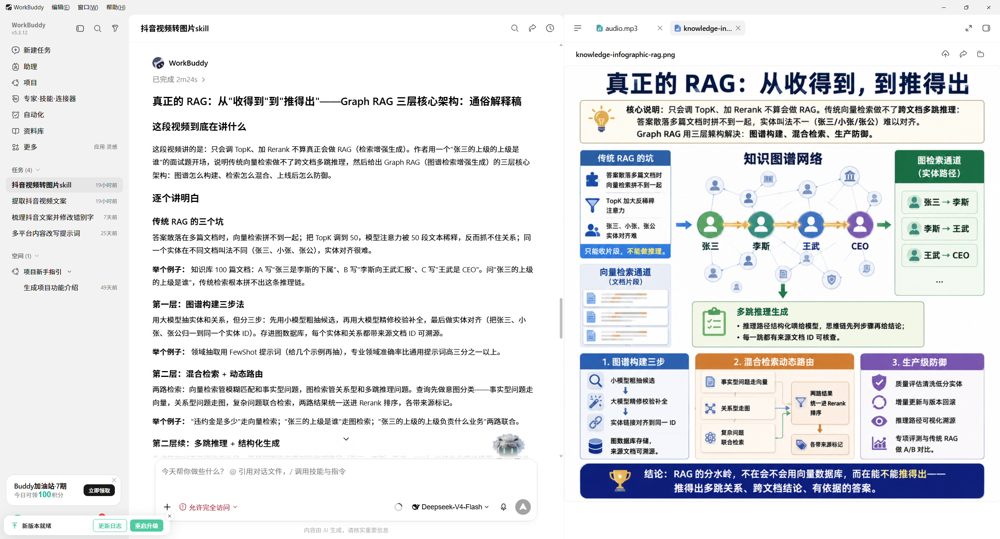
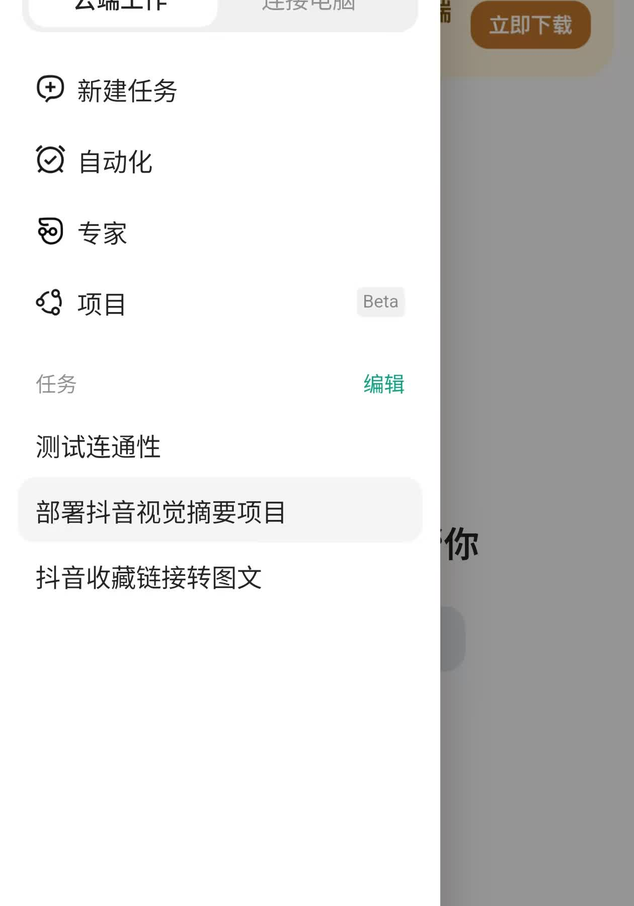
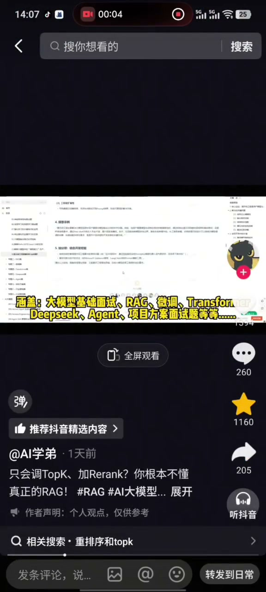
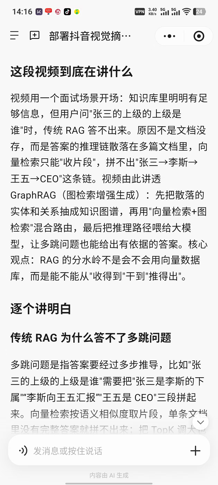
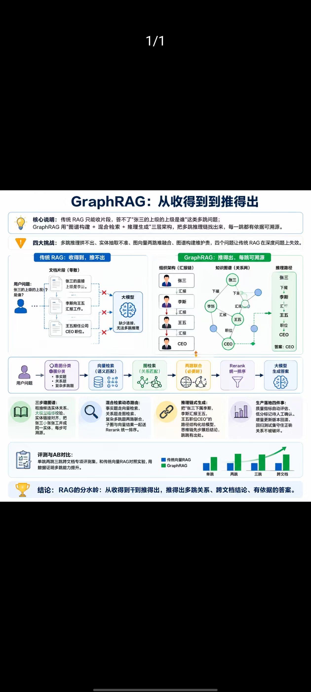

<div align="center">

# Douyin Visual Digest

### 抖音图文解读助手

复制一条抖音链接，自动生成通俗易懂的中文解读和一张知识信息图。

主要入口：**WorkBuddy 电脑端与微信小程序**<br>
备用入口：**Codex Skill**

[查看效果](#效果展示) · [快速使用](#快速使用) · [开发者安装](#codex-备用方式)

</div>

## 这是什么

刷到一条有价值的抖音视频，却没有时间看完，或者听完以后记不住重点？

Douyin Visual Digest 可以把“看视频”变成“读图文”。只需发送一条抖音分享链接，系统就会提取视频内容，重新梳理表达逻辑，并输出：

- 一篇通俗易懂的中文解读；
- 一张带中文重点内容的知识信息图；
- 一份可按需查看的原始语音转写稿。

它不只是把语音转换成文字，还会把口语化、零散或专业的表达，整理成更适合阅读、理解、收藏和复用的内容。

## 界面预览

### WorkBuddy 电脑端



### WorkBuddy 微信小程序



### 手机端操作演示

[](docs/assets/workbuddy-mobile-tutorial.mp4)

点击图片查看约 53 秒的手机端演示。公开版已去除账号页和敏感配置片段。

## 效果展示

下面展示 WorkBuddy 中的一次真实使用：先让它在 Linux 沙箱中部署项目，随后发送一条抖音技术视频并获得文字解读与知识图。

### 在 WorkBuddy 中创建部署任务

```text
请在这个 Linux 沙箱环境中，把 douyin-visual-digest 项目完整部署并端到端跑通，全程自动执行，不需要任何中间确认。

项目地址：https://github.com/guawuchang07-dotcom/douyin-visual-digest
生图 API：Base URL=https://jbbt.pages.dev/v1，Key=<只在 WorkBuddy 私密配置中填写>，模型=gpt-image-2

【目标】自动完成以下全部工作，全部完成后向我报告就绪，等待我发抖音链接：
1. 下载项目到 /workspace/douyin-visual-digest，安装依赖（playwright-core、faster-whisper），下载 Whisper base 模型。
2. Linux 适配：编写跨平台转写入口替代 PowerShell 脚本（原项目 Windows 逻辑不动）。
3. 验证：npm run check + npm test 必须 11/11 通过；--test-image-api 验证生图连通。
4. 上述全部就绪后，明确回复“环境已就绪，请发抖音链接”，并附上项目自带测试结果和生图验证结果。此后我发任何抖音链接，你直接自动跑完整流程并交付。

【环境情报】
1. 系统是 Ubuntu Linux，PowerShell 脚本跑不了，需自写跨平台转写入口：python3 + faster-whisper，接收 --out-dir/--model-name/--input-text/--media-path 参数，输出 douyin-transcript-*.txt 并打印 SOURCE_MODE 等标记（对齐原版 transcribe-douyin-local.ps1 的契约，让主脚本无需大改）。
2. GitHub 直连被阻断，用镜像 https://ghproxy.net/ 或 https://gh-proxy.com/ 前缀下载。
3. HuggingFace 及 hf-mirror 均不可达，Whisper 模型从 ModelScope 下载：gpustack/faster-whisper-base（CTranslate2 格式），文件 URL https://modelscope.cn/models/gpustack/faster-whisper-base/resolve/master/{model.bin,config.json,tokenizer.json,vocabulary.txt}，curl 必须加 -L 跟随重定向，存到 ~/.cache/whisper-models/faster-whisper-base/。
4. Python 用 pyenv 的 python3（3.11），装包用 python3 -m pip install；不要用 sudo pip。
5. Chrome 在 /usr/bin/chromium，Playwright 取视频时设置环境变量 DOUYIN_BROWSER_PATH=/usr/bin/chromium；playwright-core 需 cd 进 skill 目录 npm install。
6. 生图 API 配置写入 skill 目录 .env，chmod 600；.env 已被 gitignore 覆盖。密钥不得出现在回复、日志或任何提交中。
7. 若 /workspace/douyin-visual-digest 已存在，先检查复用，不要重复下载。

【验收 checklist】
□ npm test 11/11 通过
□ 转写脚本能输出 douyin-transcript-*.txt 并打印 SOURCE_MODE
□ 生图 API 连通（--test-image-api 成功出图）
□ API Key 未出现在任何回复与文件中
□ 未跳过任何步骤就宣称就绪
```

> 示例中的 API Key 已脱敏。请仅通过 WorkBuddy 的私密配置保存自己的密钥，不要将真实密钥粘贴进对话、截图或 GitHub。

### 输出一：通俗解读稿



### 输出二：中文知识信息图



这个示例将一条讲解 GraphRAG 的技术视频整理成完整易读的解释稿，并生成一张可保存、可转发的中文知识信息图。

## 核心功能

- [x] 识别抖音分享文本和短链接；
- [x] 获取视频内容并提取语音；
- [x] 使用 Whisper 完成中文语音转写；
- [x] 把口语内容整理成通俗易懂的中文解读；
- [x] 压缩关键信息并生成一张中文知识信息图；
- [x] 支持用户提供本地视频、音频或已有转写稿；
- [x] 标记内容来源，区分语音转写和页面摘要；
- [x] API Key 不写入 GitHub 仓库；
- [x] WorkBuddy 电脑端和微信小程序已提供实际流程演示；
- [ ] 【规划功能】历史任务和结果收藏；
- [ ] 【规划功能】视频获取失败后自动重试或上传本地视频。

## 快速使用

### 推荐方式：WorkBuddy

普通用户优先使用 WorkBuddy。电脑端和手机端使用相同的核心流程，不需要了解项目代码。

#### 第一步：启用 Skill

在 WorkBuddy 中搜索、导入或启用 Douyin Visual Digest。

#### 第二步：完成首次配置

按照 WorkBuddy 的中文引导准备生图服务，等待页面显示“准备完成”。

#### 第三步：发送抖音链接

复制抖音分享链接，发送给 WorkBuddy：

```text
https://v.douyin.com/xxxxxxxx/
```

WorkBuddy 会返回通俗解读稿和知识信息图，并保留可按需查看的原始转写稿。

## 手机端体验

手机用户可以在微信中打开 WorkBuddy 小程序，复制抖音链接后直接粘贴发送。

```text
复制抖音链接
→ 打开 WorkBuddy 微信小程序
→ 粘贴并发送
→ 等待云端处理
→ 阅读解读稿
→ 保存知识信息图
```

手机端的目标是让普通用户不需要安装 Node.js、FFmpeg 或 Whisper。视频获取、语音识别、文字整理和生图任务由云端完成。

## 首次配置

最终的知识信息图需要调用兼容 OpenAI 图片生成接口的生图服务。

1. 打开 [生图服务配置入口](https://downstream.jbbtoken.cn/i/BuFB)；
2. 注册或登录账户；
3. 充值少量生图额度；
4. 创建自己的 API Key；
5. 通过 WorkBuddy 的安全配置入口填写接口地址、模型名称和 API Key；
6. 等待 WorkBuddy 检查视频获取、语音识别和生图服务；
7. 显示“准备完成”后，即可发送抖音链接。

> 生图服务链接可能为项目作者带来推广收益。

API Key 不应该直接发送到聊天消息、GitHub Issue、截图或公开文件中。WorkBuddy 云端版本需要使用安全的密钥管理和用户隔离机制。

## 工作流程

```text
抖音分享链接
→ 解析链接并获取视频
→ 提取音频
→ Whisper 语音转写
→ 整理通俗解读稿
→ 压缩图片文案
→ 生成中文知识信息图
→ WorkBuddy 返回文字和图片
```

内容来源会通过 `SOURCE_MODE` 标记：

- `audio-asr`：已获取视频媒体并完成语音转写；
- `page-chapters`：仅取得抖音页面章节摘要，不是逐字稿；
- `provided-media`：转写用户提供的视频或音频；
- `provided-transcript`：使用用户提供的已有转写稿。

## Codex 备用方式

Codex 版本主要用于开发调试、修改提示词和二次开发，不是普通用户的首选入口。

可以把下面这段话发给 Codex：

```text
请从这个 GitHub 地址安装 Douyin Visual Digest Skill：
https://github.com/guawuchang07-dotcom/douyin-visual-digest/tree/main/skill/douyin-visual-digest
```

安装完成后进行首次配置：

```text
使用 douyin-visual-digest，帮我完成首次配置。
```

Codex 本地版本会检查 Node.js、浏览器、Playwright、FFmpeg、Whisper 和模型文件。准备完成后，可以直接发送抖音链接。

### 本地安装

```powershell
git clone https://github.com/guawuchang07-dotcom/douyin-visual-digest.git
cd douyin-visual-digest
powershell -ExecutionPolicy Bypass -File .\install.ps1
```

## 当前状态

| 使用入口 | 定位 | 状态 |
| --- | --- | --- |
| WorkBuddy 电脑端 | 普通用户主要入口 | 已提供演示 |
| WorkBuddy 微信小程序 | 手机端主要入口 | 已提供演示 |
| Codex Skill | 开发、调试和备用入口 | 已支持 |

WorkBuddy 的可用入口和云端资源配置以实际产品状态为准。

## 已知限制

- 抖音页面结构和风控规则可能变化，视频获取逻辑需要持续维护；
- 无法获取视频媒体时，系统可能降级使用页面章节摘要，并明确标记内容来源；
- 页面章节摘要不能冒充完整逐字转写；
- 生图模型生成中文时，偶尔可能出现错别字或乱码；
- 当前通过压缩文案和控制文字数量，提高中文知识图的稳定性；
- WorkBuddy 云端版本需要完成任务状态、失败重试、文件清理和用户配置隔离。

## 常见问题

### 一定要使用 Codex 吗？

不需要。项目以 WorkBuddy 电脑端和微信小程序作为主要入口，Codex 只是备用和开发者使用方式。

### 手机需要安装转写工具吗？

不需要。微信小程序版本的目标是由云端完成视频获取、语音转写和生图。

### 为什么需要生图额度？

通俗解读稿由 Agent 整理，最终的中文知识信息图需要调用图片生成模型，因此会消耗少量生图额度。

### 会直接展示逐字稿吗？

默认优先展示通俗解读稿和知识信息图，原始转写稿会保留，并可按需查看。

### 为什么有时只能得到页面摘要？

抖音可能调整网页结构或触发风控。如果暂时无法获取视频媒体，系统会明确标记为 `page-chapters`，不会把页面摘要伪装成逐字稿。

## 开发验证

```powershell
cd .\skill\douyin-visual-digest
npm run check
npm test
```

## 安全说明

- GitHub 仓库不包含任何真实 API Key；
- `.env`、`.runtime`、`outputs` 和日志不会上传到仓库；
- 每位使用者需要配置自己的生图账户，或使用 WorkBuddy 提供的安全云端配置；
- 截图、演示视频和问题反馈中必须隐藏 API Key 和个人账号信息。

## 项目地址

GitHub：<https://github.com/guawuchang07-dotcom/douyin-visual-digest>

## License

[MIT](LICENSE)
